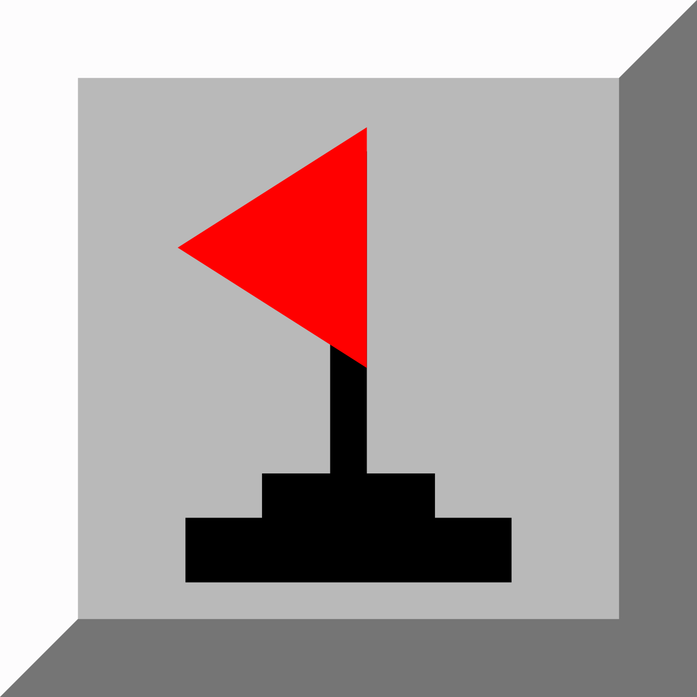

## Hey there, Im gjoe 👋

Im a pretty dumb developer (and gaming addict) who's worked on a projects in Multiple Different Languages, and I write code for [Spicy Lemon Studios](https://www.youtube.com/channel/UC2T_mGAu583_pyubsiNFQSQ "Subscribe!") 

<!--Image Link-->
[vscode]: https://code.visualstudio.com/
[Visual Studio]: https://visualstudio.microsoft.com/
[IntelliJ]: https://www.jetbrains.com/idea/
[pdn]: https://www.getpaint.net/
[unity]: https://unity.com/

[nodejs]: https://nodejs.org/en/
[csharp]: https://docs.microsoft.com/en-us/dotnet/csharp/
[html5]: https://html.spec.whatwg.org/
[css]: https://www.w3.org/Style/CSS/Overview.en.html
[java]: https://adoptopenjdk.net/
[python]: https://www.python.org/
[markdown]: https://www.markdownguide.org/

[mc]: https://www.minecraft.net/en-us
[rl]: https://www.rocketleague.com/
[fh4]: https://forzamotorsport.net/en-us/games/fh4
[ms]: https://minesweeperonline.com/
[fs2020]: https://www.flightsimulator.com/

### Languages

Here are the languages I've worked with in the past

[][nodejs] [][csharp]  [][html5] [][css] [][java] [][python] [][markdown]
### Tools

Here are some tools I've worked with

[][vscode] [][Visual Studio] [][IntelliJ] [][pdn] [][unity]

### Games

Here are some of the games I play

[][mc][][rl][][fh4][][ms][][fs2020]

### Projects 

Here are some projects I wanted to pin

### Github Stats

<!--
**gjoedev/gjoedev** is a ✨ _special_ ✨ repository because its `README.md` (this file) appears on your GitHub profile.

Here are some ideas to get you started:

- 🔭 I’m currently working on ...
- 🌱 I’m currently learning ...
- 👯 I’m looking to collaborate on ...
- 🤔 I’m looking for help with ...
- 💬 Ask me about ...
- 📫 How to reach me: ...
- 😄 Pronouns: ...
- ⚡ Fun fact: ...
-->
